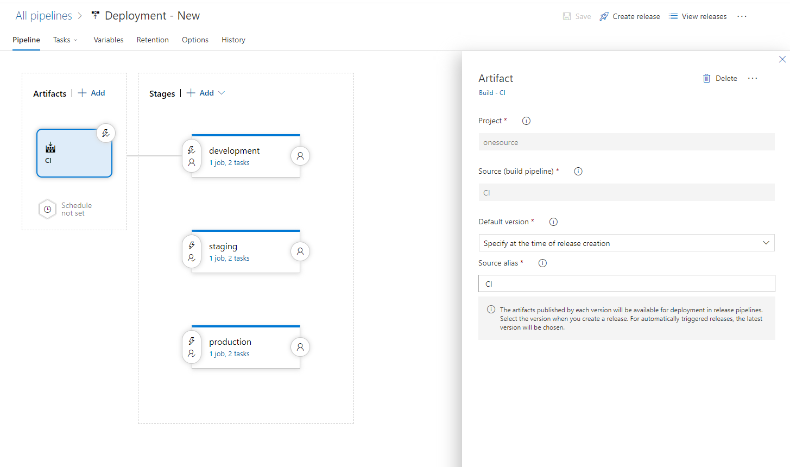
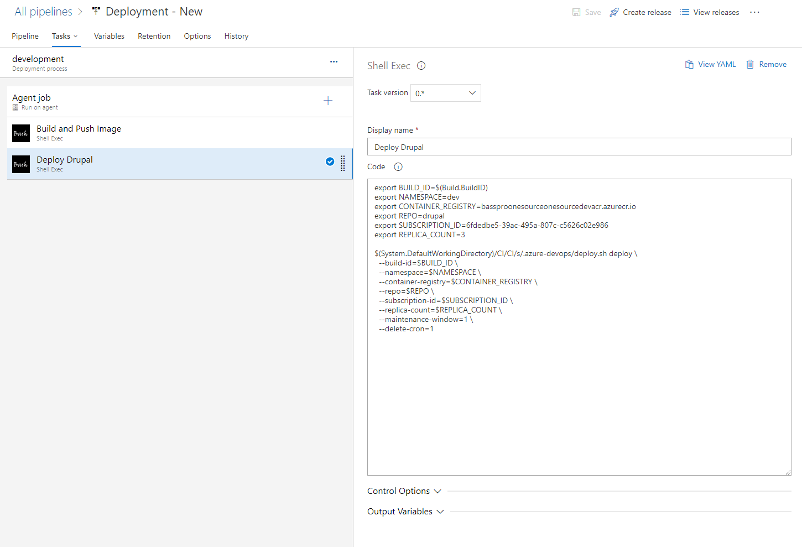

# Kubernetes Drupal Deployment Convenience Script

This repository contains a convenience script for deploying Drupal on Kubernetes. The script simplifies the process of setting up and managing a Drupal instance on a Kubernetes cluster.

## Table of Contents

- [Getting Started](#getting-started)
- [Prerequisites](#prerequisites)
- [Usage](#usage)

## Getting Started

These instructions will guide you on how to deploy Drupal on Kubernetes using the convenience script.

## Prerequisites

Before using the convenience script, make sure you have the following prerequisites installed:

- Docker
- Kubernetes cluster
- kubectl command-line tool
- method of authenticating against the kubernetes cluster

## Usage

This script is meant to be included within our devops pipeline. Examples for common DevOps platforms are below

### Installation

1. Create directory where you want to house this script
	
	```shell
	mkdir .azure-devops && cd .azure-devops
2. Download convenience script

	```shell
	wget https://raw.githubusercontent.com/mobomo/kubernetes_drupal_deployscript/main/deploy.sh
### Azure DevOps
1. Add "Shell Exec" task to Release Definition

2. Add following code in order to push prebuilt image (via your CI pipeline) to your remote registry
	
	```shell
	export BUILD_ID=$(Build.BuildID)
	export NAMESPACE=dev
	export CONTAINER_REGISTRY=bassproonesourceonesourcedevacr
	export REPO=drupal
	export SUBSCRIPTION_ID=6fdedbe5-39ac-495a-807c-c5626c02e986

	cd $(System.DefaultWorkingDirectory)/CI/CI/s/

	chmod +x .azure-devops/deploy.sh

	.azure-devops/deploy.sh push \
	--build-id=$BUILD_ID \
	--namespace=$NAMESPACE \
	--container-registry=$CONTAINER_REGISTRY \
	--repo=$REPO \
	--subscription-id=$SUBSCRIPTION_ID

3. Add following code to your deploy task

	```shell
	export BUILD_ID=$(Build.BuildID)
	export NAMESPACE=dev
	export CONTAINER_REGISTRY=bassproonesourceonesourcedevacr.azurecr.io
	export REPO=drupal
	export SUBSCRIPTION_ID=6fdedbe5-39ac-495a-807c-c5626c02e986
	export REPLICA_COUNT=3

	cd $(System.DefaultWorkingDirectory)/CI/CI/s/

	chmod +x .azure-devops/deploy.sh

	.azure-devops/deploy.sh deploy \
	--build-id=$BUILD_ID \
	--namespace=$NAMESPACE \
	--container-registry=$CONTAINER_REGISTRY \
	--repo=$REPO \
	--subscription-id=$SUBSCRIPTION_ID \
	--replica-count=$REPLICA_COUNT \
	--maintenance-window=1 \
	--delete-cron=1

These examples assume your Pipeline is set as an Artifact for the release definition and is labeled `CI`

#### Example of setting up the artifact


#### Example of the deploy task within a Release Definition
